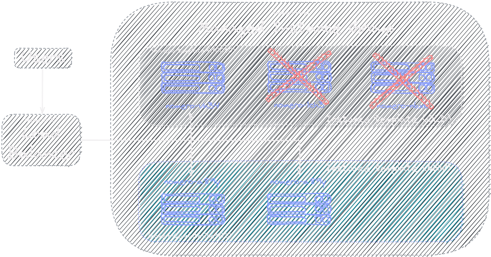

  

<h2>
  Rolling update
</h2>

In a rolling update deployment, you update a subset of running application instances instead of simultaneously updating every application instance, as the following diagram shows.

  

With rolling updates, you have flexibility in how you update your application:

<ul>
  <li>You can scale up the application instances with the new version before you scale down the old version (a process known as a surge upgrade).</li>

  <li>You can specify the maximum number of application instances that remain unavailable while you scale up new instances in parallel.</li>
</ul>

<h3>
  Key benefits
</h3>

<ul>
  <li>No downtime. Based on the window size, you incrementally update deployment targets, for example, one by one or two by two. You direct traffic to the updated deployment targets only after the new version of the application is ready to accept traffic.</li>

  <li>Reduced deployment risk. When you roll out an update incrementally, any instability in the new version affects only a portion of the users.</li>
</ul>

<h3>
Considerations
</h3>

<ul>
  <li>Slow rollback. If the new rollout is unstable, you can terminate the new replicas and redeploy the old version. However, like a rollout, a rollback is a gradual, incremental process.</li>

  <li>Backward compatibility. Because new code and old code live side by side, users might be routed to either one of the versions arbitrarily. Therefore, ensure that the new deployment is backward compatible; that is, the new application version can read and handle data that the old version stores. This data can include data stored on disk, in a database, or as part of a user's browser session.</li>

  <li>Sticky sessions. If the application requires session persistence, it's recommend that the load balancer supports stickiness and connection draining. Also, it's recommend that you invoke session-sharing when possible (through session replication or session management using a datastore) so that the sessions can be decoupled from underlying resources.</li>
</ul>

<h2>
Canary test pattern
</h2>

In this test pattern, you deploy a new version of your application alongside the production version. You then split and route a percentage of traffic from the production version to the canary version and evaluate the canary's performance.

<h3>
  Key benefits
</h3>

<ul>
  <li>Ability to test live production traffic. Instead of testing an application by using simulated traffic in a staging environment, you can run canary tests on live production traffic. With canary rollouts, you need to decide in what increments you release the new application and when you trigger the next step in a release. The canary needs enough traffic so that monitoring can clearly detect any problems.</li>
  
  <li>Fast rollback. You can roll back quickly by redirecting the user traffic to the older version of the application.</li>
    
  <li>Zero downtime. Canary releases let you route the live production traffic to different versions of the application without any downtime.</li>
</ul>

<h3>
Considerations
</h3>

<ul>
  <li>Slow rollout. Each incremental release requires monitoring for a reasonable period and, as a result, might delay the overall release. Canary tests can often take several hours.</li>
  
  <li>Observability. A prerequisite to implementing canary tests is the ability to effectively observe and monitor your infrastructure and application stack. Implementing robust monitoring can require a substantial effort.</li>
  
  <li>Backward compatibility and sticky sessions. As with rolling updates, canary testing can pose risks with backward incompatibility and session persistence because multiple application versions run in the environment while the canary is deployed.</li>
</ul>
